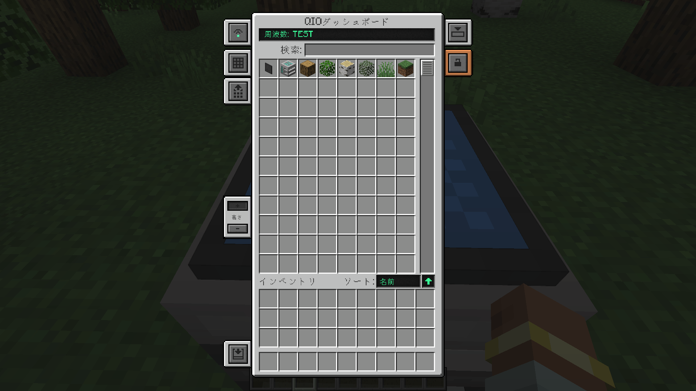

# QIO EN Search

[Mekanism](https://github.com/mekanism/Mekanism) の QIO 検索機能を強化するクライアントサイドアドオンです。  
現在のMinecraft言語設定 **と** 英語 (`en_us`) の両方でアイテム名検索ができます。

## 特徴
- 現在のMinecraft言語でのアイテム名検索
- 英語（`en_us`）でのアイテム名検索

## 例
  
*(日本語名と英語名の両方で検索可能な例)*

## 必要環境
- Minecraft 1.21.1
- Mekanism 10.7.14以降
- NeoForge 21.1.197以降

## ライセンス
このMODは MIT License のもとで配布されています。

---

# QIO EN Search（EN）

A small client-side addon for [Mekanism](https://github.com/mekanism/Mekanism) that improves QIO search.  
Allows item searches in both the current Minecraft language **and** English (`en_us`) at the same time.

## Features
- Search by localized name (your current Minecraft language)
- Search by English name (`en_us`)

## Example
  
*(Screenshot showing both Japanese and English name searches working)*

## Requirements
- Minecraft 1.21.1
- Mekanism 10.7.14 or later
- NeoForge 21.1.197 or later

## License
This mod is licensed under the MIT License.
